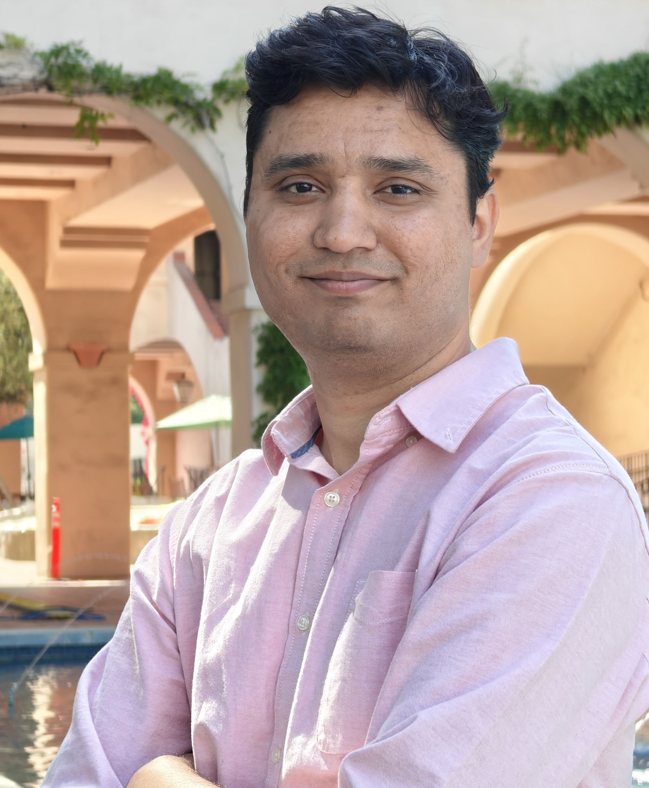

## About Me

I am a graduate student at California Institute of Technology, working on modeling and analysis of synthetic biological circuits. I am working in the [Murray Lab](http://www.cds.caltech.edu/~murray/wiki/index.php?title=Main_Page). Refer to the [Projects](https://ayush-pandey.github.io/projects) and [Publications](https://ayush-pandey.github.io/publication) page for more information on my current work. 

Before joining Caltech, I graduated with a bachelors and a masters degree from the Indian Institute of Technoloy (IIT) Kharagpur, India. My Bachelor of Technology (Hons.) degree is in instrumentation engineering and Master of Technology in 
Control System Engineering from the Electrical Engineering department. 

## Research Interests

* Control theory
* Systems and synthetic biology
* Robust and optimal control
* Robotics

---

