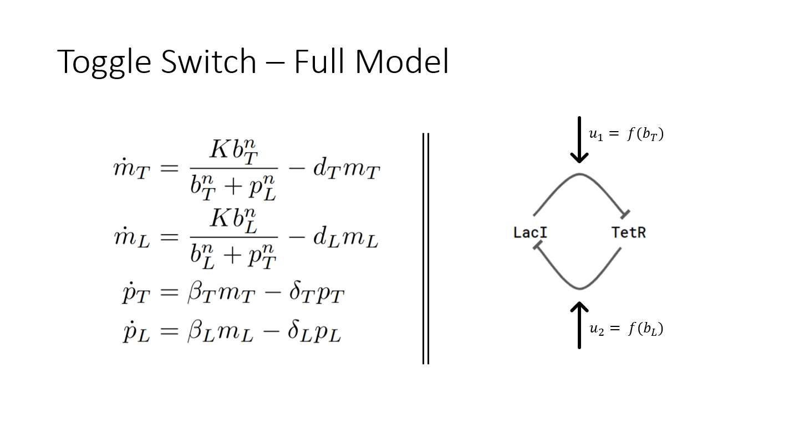
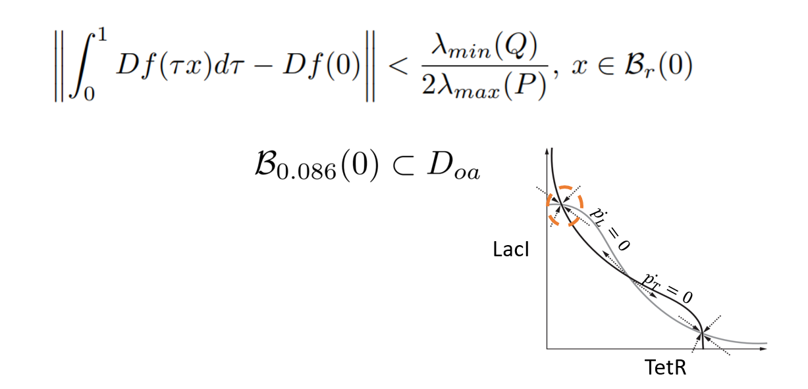
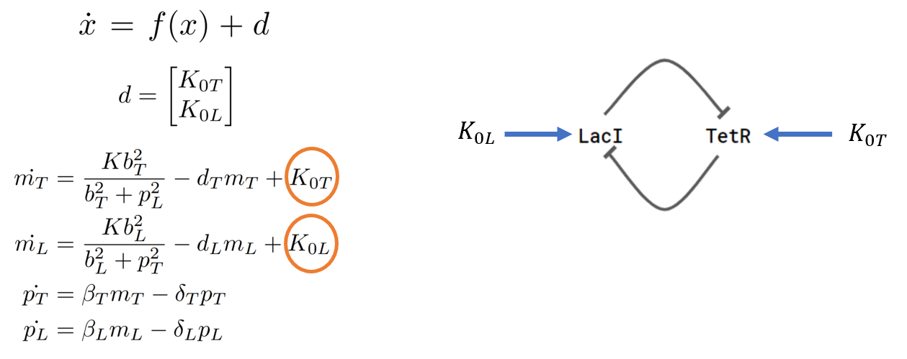
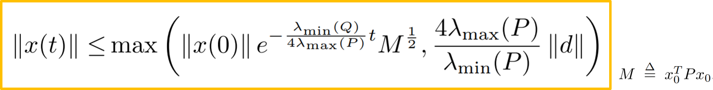

# Nonlinear Analysis of Toggle Switch
This is a class project that I worked on for a class on Nonlinear Dynamics in the Winter 2018-19 term at Caltech. In this post, I will talk about the work that I did and some of the interesting conclusions that I made from the project. 

### What is a toggle switch biocircuit? What results can we get from nonlinear analysis? 
A toggle switch is a bistable system that can be engineered out of synthetic biological parts. 
Since the first demonstration of the toggle switch1 in 2000, there have been various studies and experiments in the past decade that involve the use of such dynamics.
In this project, I studied and analyzed the nonlinear characteristics of a toggle switch model. 
Particularly, I give theoretical results regarding the stability of the equilibrium points of the two protein toggle switch circuit. 
Using this analysis, I give an estimate of the domain of attraction of a stable equilibrium point using Lyapunov methods. 
I also show that the toggle switch system is input to state stable and give appropriate bounds and convergence rates for it. 

### Toggle switch dynamics -
Two proteins - LacI and TetR repress each other. The regulation is on a transcriptional level, that is each protein binds to the gene of the other protein to prevent that gene from transcribing to mRNA (which in turn forms the protein) --- hence effectively regulating (preventing) the expression of the other protein. The mathematical dynamics given make this mechanism clear. For more details about how to derive such a mathematical model for this system, refer to Chapter 2 in this book2. 

#### Domain of attraction
We can use the math from nonlinear analysis to find out the region in state-space that is convergent. We can give guarantees of convergence and calculate a rate at which solutions converge to the equilibrium point. What's even cooler is that you can tune this convergence rate and the region of convergence as desired! But, you can't have best of both worlds, if you desire bigger region of convergence, you'll converge slowly and vice versa.

Such results are rarely, if at all, available in the literature for biological systems. There are many reasons why that's the case - Lyapunov functions are difficult to find for biological systems modeled in the way that we have done (and in the way most models are written that are helpful experimentally). Other than that, there are reasons concerning the lack of information about the processes and complexity of mechanisms due to which the modeling practices for biological applications are not advanced enough. But, we are getting there! The results such as the one presented above are an effort on that line. Talking about the uncertainty in the dynamics and biological processes, we move on to the next big conclusion that discusses how stability of the system is affected when we introduce some uncertain dynamics. 

### Input to state stability
Leaky expression is a common phenomenon observed in synthetic biological circuits. It refers to the basal expression of proteins, other than the expression due to other regulatory mechanisms. Using results from nonlinear stability theory, we can conclude bounds for when the system would be "input-to-state stable" i.e., stable under perturbations to either the system dynamics or the parameters. We can also talk about how this stability is affected. The perturbed model is given as follows

### Convergence under disturbances
For bounded disturbances in the ODEs above, we can derive conditions for the norm of the state vector and its convergence rate. Here, P is the matrix obtained in Lyapunov function, refer to the technical report (linked below) for the proof.

### Discussion 
#### Stability analysis

It is a trivial extension of the results above to prove stability using similar approach for other equilibrium points due to the symmetry in the model (the toggle switch model considered has two stable and one unstable equilibrium point). It is important to note here that unlike the traditional approach to study the stability of the toggle switch by linearization about the equilibrium points, we have given a constructive approach and derived a Lyapunov function to conclude about the stability of the nonlinear dynamics. Since the CRN level abstraction of modeling biological systems is very useful in terms of how well it can relate to the observations in an experiment, we often use dynamic models as the ones considered jere for modeling and analysis of biological circuits. But, it is not easy to come up with Lyapunov functions for such models of biological systems as they differ from mechanical or electrical systems in that there is no obvious concept of energy conservation at the CRN level modeling. Hence, the results regarding stability analysis discussed above are significant as we can use these methods in general to conclude about stability and convergence guarantees for a much wider class of models for biological systems. We could use these results to guide and predict the experimental designs and hence this is a potentially interesting future research work that could help in bridging the gaps of using systems' theory and modeling to design and engineer biological circuits.

#### Input to state stability

Uncertain parameters, unknown dynamics, and other perturbations are very common in biological systems. It is difficult to model biological systems accurately because it is often the case that these uncertainties can not be modeled due to lack of information about all of the processes that are going on. Further, due to lack of high throughput measurements, it is a big challenge and an active research area to get estimates for different parameter values in the model. With these challenges in mind, we can see that the analysis for input to state stability of nonlinear dynamic models of biological circuits could be a very useful tool. It can be used to imply important and useful results regarding the effects of different perturbations. With the toggle switch, we concluded how the leaky parameters in the protein expression affect the equilibrium reached at steady state. The bounds presented also give us guarantees of convergence to a set and their convergence rate which could be a very important tool that could be used when designing experiments.

If you have any comments, please feel free to email me (apandey AT caltech dot edu). I'll be glad to discuss the topics and related research. 

### For more details and proofs, you can read the [technical report](https://github.com/ayush9pandey/toggle_switch/blob/master/final%20report.pdf).

### All computation and simulations performed in Python - Code available [here](https://github.com/ayush9pandey/toggle_switch).

### References -
1. Gardner, Timothy S., Charles R. Cantor, and James J. Collins. "Construction of a genetic toggle switch in Escherichia coli." Nature 403.6767 (2000): 339.
2. Del Vecchio, Domitilla, and Richard M. Murray. Biomolecular feedback systems. Princeton, NJ: Princeton University Press, 2015.

